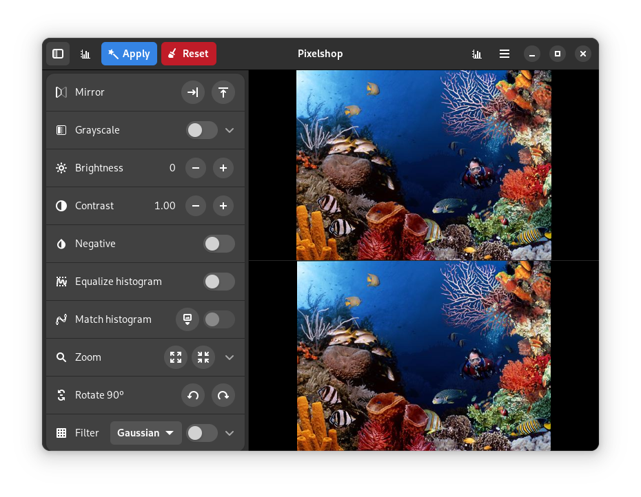
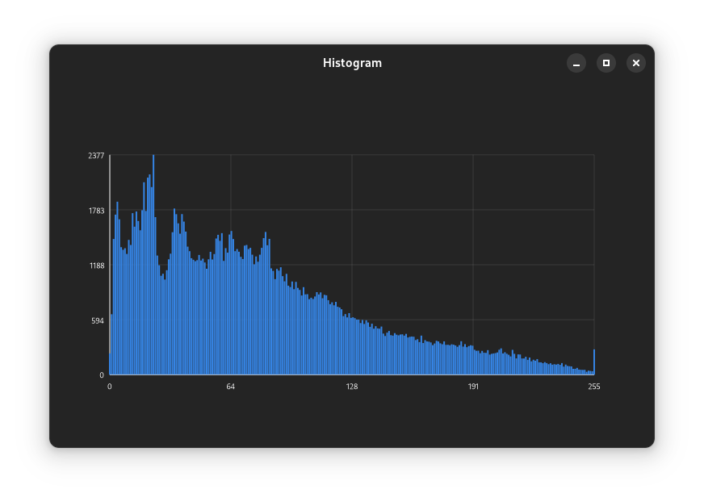
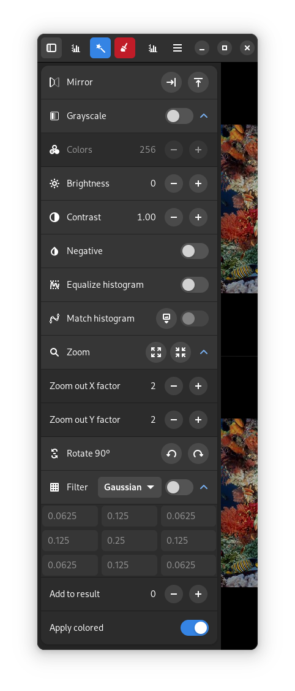
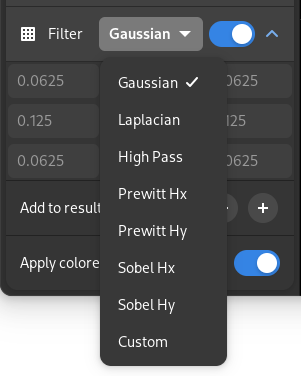

# Pixelshop

A simple GTK 4 + Libadwaita image editor

## Features

- Mirror (horizontal and vertically)
- Grayscale
- Simple color quantization (grayscale)
- Brightness adjustment
- Contrast adjustment
- Negative
- Histogram equalization (in RGB color space)
- Histogram matching
- Zoom in and out
- Rotation
- Convolution filters (customizable)
- Histogram visualization
- Adaptive UI

## Libraries used

- [GTK 4](https://www.gtk.org/)
- [Libadwaita](https://gnome.pages.gitlab.gnome.org/libadwaita/)
- [stb_image & stb_image_write](https://github.com/nothings/stb)
- [gtkchart](https://github.com/lundmar/gtkchart) ([modified](https://github.com/jspast/gtkchart/tree/histogram))

